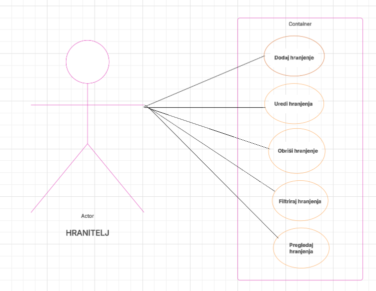

## Sustav za evidenciju hranjenja životinja u ZOO-u
    - svrha aplikacije: Hranitelj će moći unositi i ažurirati podatke o vrstama životinja, hrani, količinama te vremenu hranjenja.
    - Na taj način hranitelj bilježi podatke o prehrani životinja, vodi evidenciju hranjenja te zaposlenici lakše prate kada je bilo zadnje hranjenje

## Razrada projekta:
1. USE CASE za ovaj projekt je bio Sustav za praćenje hranjenja životinja u ZOO. Akter je "Hranitelj", a u Container su dodane opcije
Dodaj hranjenje
Uredi hranjenje
Obriši hranjenje
Filtriraj hranjenja (po vrsti životinje, hrane i datumu)
Pregledaj hranjenja
Vizualizacija (za sve životinje općenito)

## USE CASE:
    

Aplikacija je razvijena kao dio projekta iz kolegija Informacijski Sustavi, s ciljem usvajanja znanja iz područja razvoja web servisa, 
povezivanja frontenda i backenda te rada s bazama podataka i Dockerom.

## POKRETANJE APLIKACIJE:

- potrebno pokrenut s Dockerom

    opcija 
        a. preuzeti file, pokrenut preko terminala
        b. git clone, pokrenut preko terminala

    **pokretanje unutar terminala:

        ```bash
        git clone https://github.com/itokac/InfSUS.git
        cd zoo-hranjenje
        ```bash

        ```bash
        docker build -t zoo-hranjenje
        docker run -p 8000:8000 zoo-hranjenje
         ```bash
         
        http://127.0.0.1:8000/  #otvara u pregledniku
        http://127.0.0.1:8000//hranjenje #backend json podatci

## Dodatno - korištene tehnologije:
    Backend koristi Flask + PonyORM + SQLite (lokalna baza se automatski kreira i sprema kao file db.sqlite koji se može otvorit pomoću DB Browser etc.)
    Frontend koristi HTML + CSS + JS 
    Vizualizacija je napravljena pomoću grafa koji koristi biblioteku Chart.js
    Sve radi unutar jednog Docker image-a, koji sadrži frontend i backend
    Baza je trajna unutar containera, moguće proširenje


## Autor: 
    Ivana Tokić, 0131085441